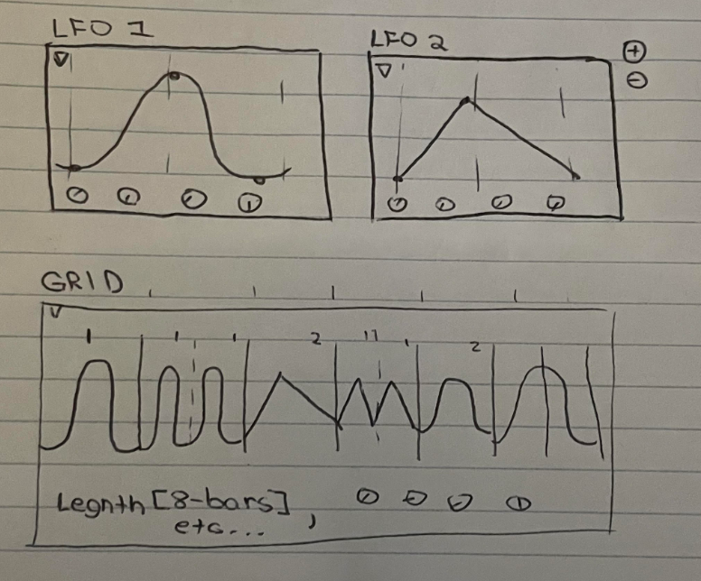

# LFO Pattern Tool - Initial Prototype User Requirements

## Concept Overview

**Wobbler** is a pattern-based LFO modulation plugin designed to give producers fine-grained, rhythmic control over any automatable parameter in their DAW. Rather than relying on a single repeating shape, Wobbler allows users to create multiple custom LFO shapes and arrange them like musical phrases across a time-based grid. Each shape can be independently designed and dropped into a sequencer-like timeline, determining when and how long the modulation occurs.

The plugin is built for flexibility and expression, offering precise timing control, customizable waveforms, and tempo sync. It is especially useful in styles of music where modulation is part of the rhythmic or textural identity—such as electronic, experimental, or cinematic production. Wobbler’s design enables producers to treat modulation not just as automation, but as a compositional element.

Conceptual UI:

## Core User Requirements

### LFO Shape Editor

* **Intuitive point-based editing:** Users need to easily add, move, and delete points on the LFO shape
* **Visual feedback:** Real-time shape preview as points are moved
* **Curve adjustment:** Controls to adjust the curve between points (linear, curved, stepped)
* **Quick initialization:** One-click buttons for standard waveforms (sine, triangle, square, saw)
* **Reset option:** Clear button to start over when editing goes wrong
* **Point snapping:** Optional grid snapping for precise value placement
* **Scale controls:** Adjust overall amplitude of the shape
* **Bipolar/unipolar toggle:** Switch between centered (bipolar) and positive-only (unipolar) modes

### Grid Pattern Sequencer

* **Clear visual divisions:** Easy-to-see bar and beat markings
* **Tempo sync:** Automatic synchronization with DAW tempo
* **Adjustable grid resolution:** Simple control to switch between 1/4, 1/8, 1/16, 1/32 note divisions
* **Pattern length control:** Adjustable pattern length up to 16 beats
* **Visual representation:** LFO shape clearly visible within each grid cell
* **Easy placement:** Simple click or drag to place the active LFO in a grid cell
* **Easy removal:** Quick way to clear specific grid cells
* **Visual playhead:** Clear indicator showing current playback position
* **Loop markers:** Visual indication of pattern start/end
* **Zoom control:** Allow users to zoom in/out horizontally in the pattern grid for detailed editing of longer sequences
* **Scroll + Zoom synchronization:** Ensure horizontal scrolling updates in sync with zoom level
* **Zoom shortcuts:** Include mousewheel + modifier key (e.g., Ctrl/Cmd + scroll), pinch-to-zoom, and a zoom slider
* **Fit to view:** “Fit Pattern to View” button to auto-scale the visible range
* **Zoom level indicator:** Optional numeric zoom level or percentage display

### User Controls

* **Parameter assignment:** Clear indication of which parameter is being modulated
* **Modulation depth:** Simple slider to control overall intensity
* **Bypass button:** Quick enable/disable of modulation
* **Phase control:** Adjust starting position of the LFO
* **Smoothing control:** Adjust transition smoothness between different LFO segments

### Workflow & Usability

* **Consistent visual language:** Color coding that maintains consistency between editor and grid
* **Minimal clicks:** Design interface to minimize actions needed for common tasks
* **Tool tips:** Helpful explanations for all controls
* **Undo/redo:** Support for reversing mistakes
* **Pattern presets:** Save and recall entire patterns
* **Shape presets:** Save and recall LFO shapes separately from patterns
* **Responsive UI:** Interface should be resizable without losing functionality
* **Context-sensitive help:** Brief explanations accessible through right-click or hover

## Interface Design Considerations

### LFO Editor Panel

* Keep editor at a reasonable size (at least 200x150 pixels) for precise editing
* Clear value indicators showing current position of selected points
* Visible grid lines for reference
* Visual distinction between selected and non-selected points

### Grid Panel

* Clear delineation between bars and beats
* Consistent sizing of grid cells based on resolution
* Horizontal scrolling when pattern length exceeds visible area
* Highlighting of current beat during playback
* Visual scaling of LFO shape to fit within grid cells while maintaining recognizable form
* LFO blocks must remain legible at all zoom levels
* Maintain beat/bar visibility when zoomed in or out
* Smooth scaling animation when zooming
* Prevent graphical aliasing when zoomed in

## Performance Indicators

* Indicator for when modulation is actively changing a parameter

## Technical Requirements from User Perspective

### Responsiveness

* No perceivable latency when editing shapes or placing in grid
* Smooth visual updates during playback
* No audio glitches when changing parameters

### Compatibility

* Works consistently across different DAWs
* Maintains state when project is saved and reopened
* Adapts to different display resolutions and scaling factors

### Export/Import

* Ability to export patterns for sharing with other users
* Import capability for patterns created elsewhere
* Consistent format that can be expanded for future versions

## Future-Proofing (Planning for Scalability)

* UI design that can accommodate additional LFO modules without major redesign
* Data structures that support expansion to multiple LFOs
* Parameter system that can handle multiple modulation targets
* Clear visual distinction in UI between current features and "coming soon" placeholders

